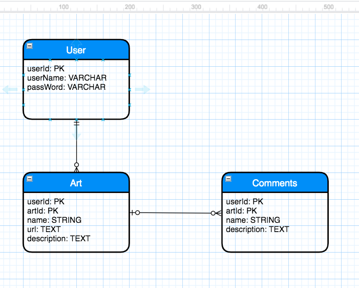

# Art-Block-To-Block

## Adding content


## Project Description
Imagine walking the block and art hits you. Blam! Who's the artist and did anyone else see this? Welcome to Art-Block-To-Block.

On this site you can browse the Gallery and find the artist behind the art. And or just enjoy the unknown artist work and leave a comment. Maybe, you can be the one to guide someone to more of there work.

## Feature List 

### MVP
* User Auth(Login/Register)
* User creates an artistlist
* User adds items to artistlist
* User deletes items from artistlist
* User Edits items on artistlist
* Homepage which lists most viewed art 

###Post-MVP:
* Animations
* Mobile Friendly
* User can add more artistlists
* User can change background color/image of artistlist page
* User can move items from one artistlist to another

## Entity Relationship Diagram



## API Endpoint Documentation

|Endpoint|Purpose|
|---|---|
|/users|for User - Read Index and Create|
|/users/:userId|for User - Read Show, Update, and Delete|
|/users/:userId/artistlists|for artistlist- Read Index and Create |
|/users/:userId/artistlists/:artistlistId|for artistlist - Read Show, Update, and Delete |
|/users/:userId/artistlists/:artistlistId/items|for Item - Read Index and Create |
|/users/:userId/artistlists/:artistlistId/items/:itemId|for Item - Read Show, Update, and Delete |

## Wireframes


### Main Page


### Landing Page


## Component Heirarchy

```
<App>
  <Header>
  <Main>
    <registerFom>
    <loginForm>
    <userPage>
      <artistlist>
        <createartistlist>
        <updateartistlist>
        <deleteartistlist>
      <items>
        <createItems>
        <updateItems>
        <deleteItems>
  <Footer>
```


## Dependencies

### Front-End Dependencies
* React
* Axios
* React-Router

###Back-End Dependencies
* Ruby on Rails
* Sequelize
* Cors
* pg
